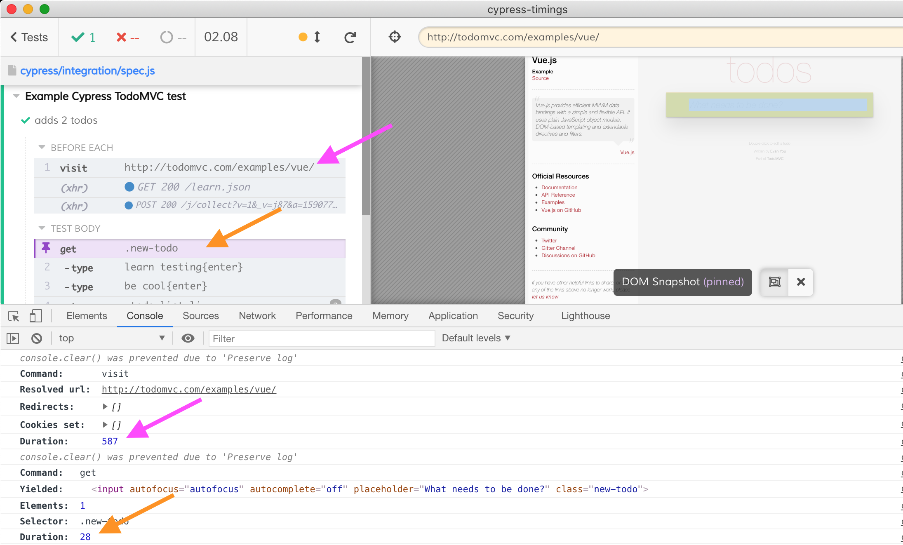

# cypress-timings [![ci status][ci image]][ci url]
> A Cypress plugin for reporting individual command timings

When clicking on the individual command you will see command duration (in milliseconds)



**Note:** This is NOT the exact command duration, since we are only getting an event some time after the command finishes. Still better to have approximate value than nothing.

## Install and use

```shell
npm i -D cypress-timings
# or
yarn add -D cypress-timings
```

Add to your Cypress support file

```js
import { commandTimings } from 'cypress-timings'
commandTimings()
```

[ci image]: https://github.com/bahmutov/cypress-timings/workflows/ci/badge.svg?branch=main
[ci url]: https://github.com/bahmutov/cypress-timings/actions
